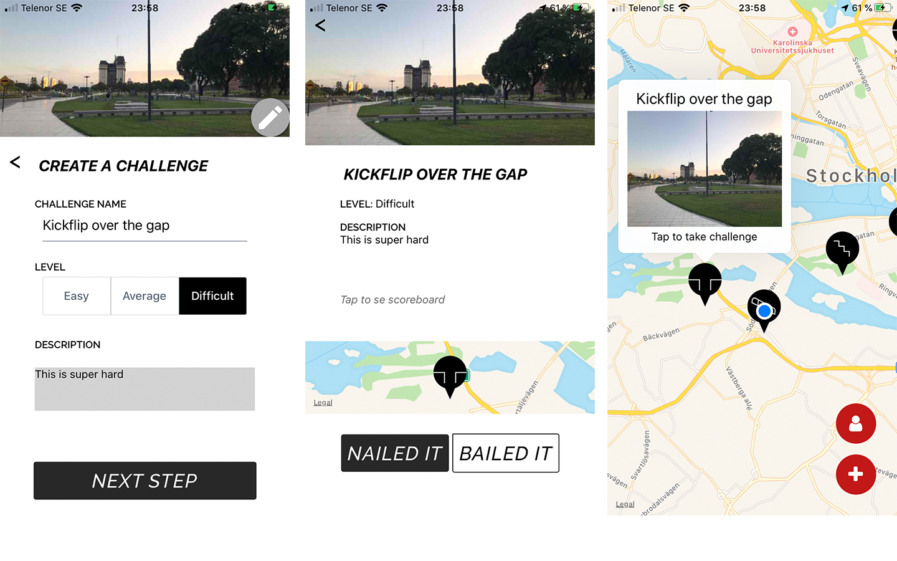

## Project
Challenge Me is an app for challenging your skater friends to bust a trick at specific locations. Once you have added a challenge, your friends can find them on the map and take on the challenge. This App was built using React Native and Firebase for the back-end and log in possibilities. 

## Challenge
The aim of the project was to explore mobile development and creating a interactive application for a specific target group. Having a few old skaters in the development team made the project engaging and helped to really understand the potential target group.

## Results 
The results are a App for the community of skaters that lets them create and invite each other to diffrent challenges.

