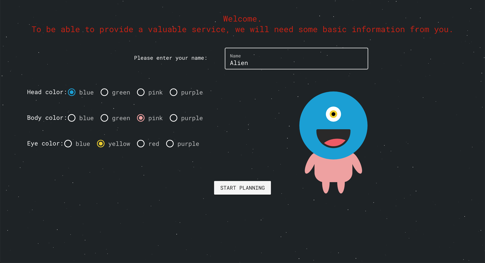

## Project
The world has come to an end and you have to move to a new planet, but where should you go? Tatooine? Naboo? Or maybe Endor? Evacuate Me is a web-based quiz game that helps you decide by narrowing down your choices according to your preferred climate, population size, gravity and even time. It is built using **Vue.js**, **Firebase** and **SWAPI**(Star Wars API) and will hopefully help you in the search for your new home.
## Challenge
The main challenge was to create a fun and interactive experience while using an API of choice. SWAPI was chosen due to its endless of data and possibilities of creating an exciting game. 
## Results 
The game includes customizing your own avatar, choose your preferences of different characteristics of the planet and then in the end see which people have been evacuated to the same planet.

Check out the **webpage** [here](https://evacuate-me-d8a07.firebaseapp.com/) and the **Github** repository [here](https://github.com/lindacnatt/Evacuate-Me)

