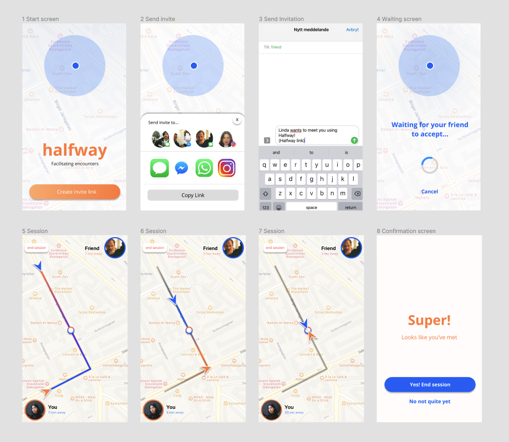
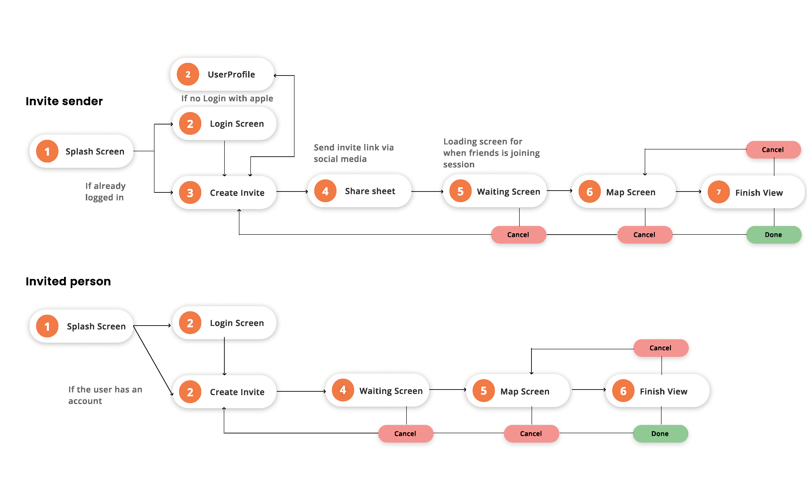
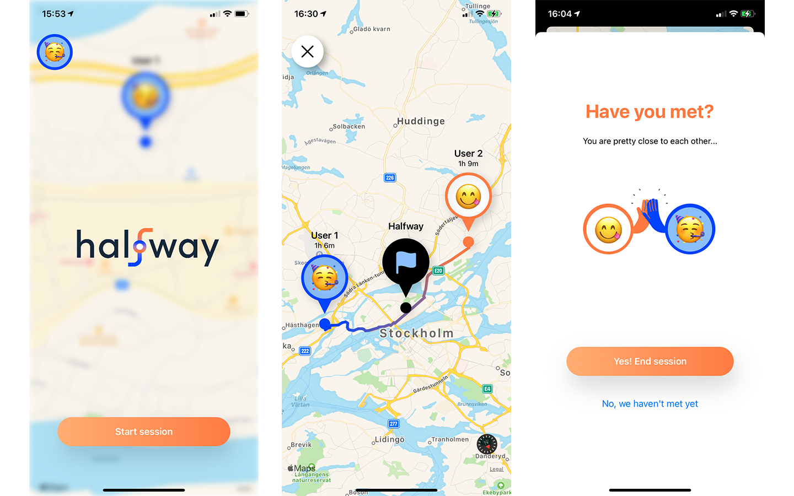

## Project
Halfway propose the development of technology for easy spontaneous physical meetings through the creation of the native iOS application. Halfway lets users, in a swift and easy manner, calculate the half-way point between themselves and a friend and enables temporary location sharing in secure navigation-sessions. These sessions feature real-time location updates for both parties as well as GPS navigation to a shared half-way point. 

## Challenge
Our goal was to create an innovative map-based application that fills the need of social meetings during social distancing.

Our high level goals were to make it:
1. **Easy** - Without having to write in all the locations, the app automatically uses all the participants locations to calculate a meeting point. The app creates a session where you can include people who have not used the app 

2. **Safe** - Promotes walking and outdoor meetings. 

3. **Fun** - Be able to see each other on the map and see that you're both travelling towards the same location. Flow, Gamification,Animations, Interesting loading screens, haptic feedback

## My role
As this application was created by a small team of 3 people, we all had several roles. My main roles were:
1. **UX/UI design** - Where I both designed and created prototypes of the visual design and user flow in Figma as well as usability tested them. I also created the animations and logotype of the app.
2. **IOS-Developer** - Where I developed several screens of the application, such as the "sign in"-page and landing page. I also was responsible of the back-end which we used Firebase for. I created the database structures for each "Halfway"-session. 
3. **Project Manager** - I took on the responsibility of structuring and planning our work process, by setting up a kanban board, creating a Notion page with subpages for each step of the design- developing- and report writing process.

## Process
By researching the state-of-the-art of mobile applications for finding friends, we could see a lack of focus of the meeting-up aspect. Many apps focused solely on displaying realtime updates of friends geo-locations or only on finding certain locations on the map. 

By sending out surveys in different channels and forums, we received insights of how people behave and what tools are used in situations of planning and discussing meet ups with friends. The results inspired the main functionalities of the application. A high-fidelity prototype was created in **Figma** and **usability tested** before the application was developed using Swift. The finalized version of the application was also **usability tested** and gave the insights that there was a need of this kind of application and that the aspects of simplicity and micro-interactions enhances the user experience. 

*First draft of the high-fidelity prototype*

## Results
A finalized application, that soon will be available on Testflight. Below you can see the simple user flow for the application

The core concept is to let users send invitations to friends, letting them temporarily see each other’s positions, and allow the application to suggest locations in which to meet up. The app strives to optimize time and distance for all parties and to suggest separate real-time navigation to a joint meeting point in an attempt to make meeting up as easy as possible.

