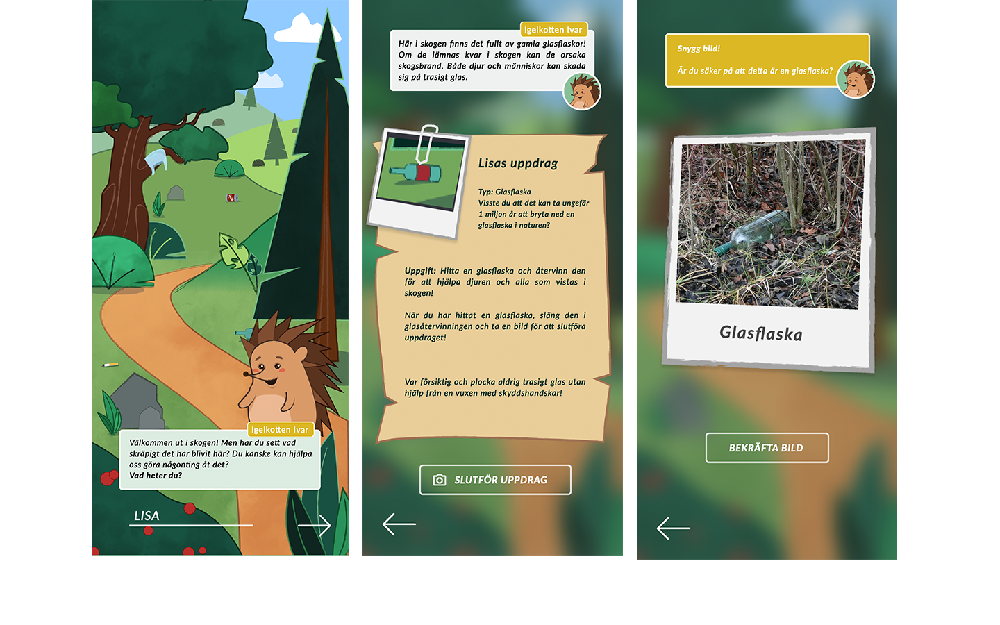

## Project
Litter Heroes is a concept of a mobile application which approaches the problem of littering by creating a fun and educational experience for children by using serious gaming and storytelling.
## Challenge
Littering is a universal problem with multifaceted impacts on both our lives and the planet we inhabit. The challenge of this project was to create a mobile application that would both decrease littering and build awareness towards the environment.

## My role
In this team we all had overarching roles, but my focus area was mainly on the UX and UI design of the application. I created and designed the main illustrations and visualization using **Illustrator** and then importing it to **Figma**. In Figma my coworker and I added the functionality and finalized the high-fidelity prototype. 

## Process
Collaborations with the organizations and initiatives **Håll Sverige Rent** and **Sundbybergs stad** gave insights into how they work with children to teach them about reducing litter which gave us further research and inspiration for our prototype.

## Results
The main objective of the game is to complete several missions. The missions are all structured so that the user is supposed to find a certain type of litter and to photograph and properly dispose of the litter. By completing the missions the user helps the hedgehog to clear his forest of litter so he and his friends will not get hurt by it. 

The application consists mainly of an interactive visualization. It consists of an illustrative image of a forest and interactive elements in the form of pieces of litter and trash. These litter pieces are scattered throughout the forest and invite the users to clean it up by picking up litter in their local area. As the litter is picked up in the real world, the pieces of litter disappear in the application’s forest. The aesthetics for the visualization have an important role in keeping the user’s attention as well as being appealing to them. Therefore a cartoon-like and colorful art style is used.

The game guide character is an anthropomorphic hedgehog that is designed to have a cute appearance and to evoke altruistic behaviours among the user.

Check out the Figma prototype below or [here](https://www.figma.com/proto/EF84OjGYwnTvbKCt0koe9W/Skr%C3%A4papp?node-id=32%3A2&scaling=min-zoom)

<figure class="video_container">
 <iframe style="border: 1px solid rgba(0, 0, 0, 0.1);" width="600" height="450" src="https://www.figma.com/embed?embed_host=share&url=https%3A%2F%2Fwww.figma.com%2Fproto%2FEF84OjGYwnTvbKCt0koe9W%2FSkr%25C3%25A4papp%3Fnode-id%3D32%253A2%26scaling%3Dscale-down" allowfullscreen></iframe>
</figure>

